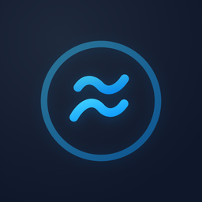

# SynthPulse Agentic Workstation — engine fork

This repository is **Synthwave Solutions'** fork of [Nous Research's Hermes Agent](https://github.com/NousResearch/hermes-agent),
the open-source agent engine that powers our **SynthPulse Agentic Workstation** product.

It is kept as a **clean fork** (no edits to upstream source) so we can pull Nous updates with
`git fetch upstream && git merge upstream/main`. Synthwave-specific additions live in non-source
files only (this doc + `branding/`).

## How it fits together

| Repo | Role |
|---|---|
| **this repo** (`hermes-agent`) | the **engine** — the full Hermes Agent (gateway, skills, memory, desktop app under `apps/desktop`) that SynthPulse provisions |
| [`synthpulse-agentic-workstation`](https://github.com/Synthwave-Solutions/synthpulse-agentic-workstation) | the **deploy template** — env-driven Raspberry Pi kit (systemd units, backup, health, dreaming, self-healing) that stands the engine up at a client |
| [`hermes-desktop`](https://github.com/Synthwave-Solutions/hermes-desktop) | the **branded desktop app** — SynthPulse-themed standalone build of `apps/desktop` |

## Branding note

"SynthPulse Agentic Workstation" is the Synthwave product name. The engine's internal protocol,
env vars (`HERMES_*`), package names and APIs remain **Hermes** — branding is applied at the
product/packaging and UI layer, not the wire layer, so everything stays upstream-compatible.

Engine © Nous Research, MIT. SynthPulse branding/template © Synthwave Solutions, MIT.
See the upstream `README.md` below for the Hermes Agent documentation.
