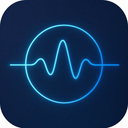

<p align="center"></p>

# SynthPulse Agentic Workstation: engine fork

This repository is **Synthwave Solutions'** fork of
[Nous Research's Hermes Agent](https://github.com/NousResearch/hermes-agent), and
it is the **agent runtime** of our SynthPulse Agentic Workstation product. It is
the process that holds a conversation, calls tools, persists sessions, runs the
gateway that connects chat platforms, serves the browser dashboard, and schedules
cron jobs. Everything a client actually talks to when they use SynthPulse runs
here. The upstream `README.md` below documents the engine itself; this file
documents the fork.

It is **not** a clean fork. Alongside the SynthPulse branding it carries a
dashboard governance (RBAC) layer, profile scope enforcement in the tool seams,
and OmniRoute context-window resolution. An earlier version of this document
claimed no upstream source was edited; that stopped being true and the claim has
been removed rather than left to mislead the next person planning a merge.

| I want to know | Read |
|---|---|
| What is ours versus upstream, file by file, and the invariants not to touch | [docs/FORK.md](docs/FORK.md) |
| How to rebase onto upstream and get the result into a published image | [docs/REFRESH.md](docs/REFRESH.md) |
| How the RBAC layer works and how to roll it out | [docs/dashboard-governance.md](docs/dashboard-governance.md) |
| How the engine itself works | the upstream `README.md` below, and `CONTRIBUTING.md` |

## Where this sits in the product

SynthPulse Agentic Workstation is Synthwave Solutions' productised,
client-deployable agentic workstation. The hub repository
(`synthpulse-agentic-workstation`) is the deliverable: it carries the docker
compose stack, the terraform roots, the client lifecycle CLI, the modules and the
customer documentation set. This repository is one component the hub consumes.

| Repository | Role |
|---|---|
| `synthpulse-agentic-workstation` | hub and deliverable: stack, terraform, client lifecycle CLI, docs |
| **this repository** (`hermes-agent`) | the **engine**: agent runtime, gateway, tools, dashboard backend and frontend |
| `hermes-webui` | our fork of the team dashboard, pinned separately by `SP_WEBUI_REF` |
| `hermes-desktop` | branded desktop client built from `apps/desktop` |
| `synthwave-omniroute` | the LLM router the engine talks to |

### How this repository reaches a client

Clients never clone this repository. The path is:

1. The hub's `Dockerfile` clones this fork and checks out an exact commit pinned
   by `ARG SP_ENGINE_REF`, runs `setup-hermes.sh` to build the Python
   environment, and builds the web dashboard bundle.
2. That produces the core image
   `ghcr.io/synthwave-solutions/synthpulse-agentic-workstation`, tagged `:edge`
   on the hub's `main` and `:X.Y.Z` plus `:latest` on a version tag.
3. The hub's WebUI image is built `FROM` that core image, because the WebUI
   imports the engine in-process.
4. A client deployment pulls those images. Versions move only through the weekly
   stack refresh.

Consequence, spelled out because it has bitten a release: **pushing this fork
changes nothing for clients until `SP_ENGINE_REF` moves in the hub.** The clone
step is a single cached Docker layer, so an unchanged pin means the new image
silently contains the old engine. [docs/REFRESH.md](docs/REFRESH.md) covers this.

## Repository layout

Upstream's layout, unchanged. The directories worth knowing:

| Path | What lives there |
|---|---|
| `run_agent.py`, `cli.py`, `model_tools.py`, `toolsets.py`, `hermes_state.py` | agent core: conversation loop, interactive TUI, tool dispatch, tool groupings, SQLite session store |
| `agent/` | agent internals split into modules (API dispatch, context compression, model metadata, adapters) |
| `hermes_cli/` | the `hermes` CLI: subcommands, config, gateway management, dashboard backend (`web_server.py`), and our `dashboard_governance/` package |
| `hermes_cli/web_dist/` | build output of `web/`, served as a static SPA (generated, do not edit) |
| `web/` | Vite + React 19 dashboard frontend |
| `gateway/` | the always-on process and its chat platform connectors |
| `tools/` | tool implementations (files, terminal, browser, approval, and our profile scope bridge) |
| `apps/desktop`, `apps/shared`, `ui-tui/` | desktop client and terminal UI packages |
| `plugins/`, `optional-skills/`, `optional-mcps/`, `skills/` | pluggable auth and runtime plugins, skills, MCP servers |
| `tests/`, `tests-js/` | Python and JavaScript test suites |
| `docs/` | upstream docs plus our `FORK.md`, `REFRESH.md`, `dashboard-governance.md` |
| `branding/` | SynthPulse brand tokens (`brand.json`), icons and wavemark |
| `scripts/` | developer tooling, including the canonical test runner `run_tests.sh` |

## Run and build it locally

Setup, from a clone of this fork:

```bash
./setup-hermes.sh          # creates ./venv, installs deps (uv, hash-verified from uv.lock), links `hermes`
```

The dashboard frontend is a separate build. Its output directory is
`hermes_cli/web_dist`, not `web/dist`:

```bash
npm install --workspace web
npm run build -w web
test -s hermes_cli/web_dist/index.html && echo "bundle present"
```

Frontend development, with hot reload against a running backend:

```bash
python -m hermes_cli.main web --no-open   # backend on 127.0.0.1:9119
cd web && npm run dev                     # open the Vite URL, not 9119
```

`hermes dashboard` serves the **built** bundle, so frontend changes do not show up
there until you rebuild. See `web/README.md` for the frontend conventions.

Tests:

```bash
scripts/run_tests.sh                                                     # full suite, matches CI
scripts/run_tests.sh tests/hermes_cli tests/agent tests/tools tests/run_agent   # the fork-sensitive roots
```

Entry points, after install: `sp-engine`, `sp-engine-agent` and `sp-engine-acp`
are the SynthPulse names; `hermes`, `hermes-agent` and `hermes-acp` remain as
aliases. `./hermes` in a checkout is a thin launcher for the same CLI.

## CI

This fork publishes no container image and no package. Upstream's workflows are
inherited as-is, and the jobs that build and push the `nousresearch/hermes-agent`
image, deploy the docs site and regenerate the skills index are gated on
`if: github.repository == 'NousResearch/hermes-agent'`, so they are skipped here.

What does run on a pull request or a push to `main` in this fork is the `ci.yml`
orchestrator, which detects changed paths and calls the sub-workflows via
`workflow_call`: `tests.yml` (sliced pytest), `lint.yml` (ruff plus a blocking
`ruff check .`), `js-tests.yml` (per-workspace npm checks), `docker-lint.yml`
(hadolint and shellcheck), `uv-lockfile-check.yml`, `osv-scanner.yml` and
`supply-chain-audit.yml`. A single `all-checks-pass` gate job aggregates results.
`js-autofix.yml` is inherited ungated: on a push to `main` it can open a
`bot/js-autofix` pull request with lint fixes, which needs an App token to work
at all in this fork.

The container image a client receives is built by the **hub** repository's
workflow, not here. See [docs/REFRESH.md](docs/REFRESH.md) step 6.

## Configuration

Configuration lives in a Hermes home directory, not in this repository.

| Setting | Kind | Default | Notes |
|---|---|---|---|
| `HERMES_HOME` | env var | `~/.hermes` on POSIX, `%LOCALAPPDATA%\hermes` on Windows | data and config root. Subprocess spawners must propagate it explicitly, or a non-default profile silently writes to the default one. The hub sets it to the container user's home. |
| `HERMES_PROFILE`, `HERMES_CONFIG`, `HERMES_ENV` | env vars | unset | launch-scope overrides; these cannot be persisted through `hermes config set` |
| `display.skin` | config key | unset (falls back to upstream `default`) | set to `synthpulse` for SynthPulse terminal branding, or run `hermes skin use synthpulse`. The hub does not currently set this. |
| `dashboard.governance.policy_file` | config key | `<hermes home>/dashboard-governance.yaml` | RBAC policy location |
| governance `mode` | inside the policy file | `off` | `off`, `report_only` or `enforce`. Go through `report_only` first. |
| `HERMES_DASHBOARD_GOVERNANCE_CONTEXT` | env var | unset | internal: propagates the resolved governance context to child processes. Not an operator knob. |
| `HERMES_DASHBOARD_URL` | env var | `http://127.0.0.1:9119` | frontend dev only: where the Vite proxy and dev token scraper point |
| `HERMES_YOLO_MODE` | env var | unset | bypasses approval prompts. Never set on a client deployment. |

**Secrets.** Provider API keys, bot tokens and webhook secrets are read from the
environment or from `.env` in the Hermes home, following `.env.example` at the
repo root as the template. They are never committed here, never written into
`branding/` or `docs/`, and never quoted in documentation. Python dependencies are
exact-pinned in `pyproject.toml` with `uv.lock` recording hashes: bump a pin and
regenerate the lock together, or the container build's frozen sync fails.

## Attribution

Engine: Hermes Agent, Copyright (c) 2025 Nous Research, MIT (see `LICENSE`,
unchanged). SynthPulse branding, the governance layer, the profile scope
enforcement and the OmniRoute integration: Synthwave Solutions, contributed under
the same MIT terms. "SynthPulse Agentic Workstation" is the Synthwave product
name; the engine's protocol, environment variables (`HERMES_*`), package names and
APIs stay Hermes on purpose, so the fork remains rebaseable onto upstream. Details
and the full invariant list: [docs/FORK.md](docs/FORK.md).

## Where to go next

For deployment, operations and acceptance, read the hub repository's docs (they
are separate repositories, so these are names to look up, not links):
`docs/QUICKSTART.md`, `docs/DEPLOY-RUNBOOK.md`, `docs/OPERATIONS.md`,
`docs/ACCEPTANCE.md`, `docs/CLIENT-CONFIG.md`, `docs/WEBUI.md`,
`docs/OMNIROUTE.md`, `docs/ARCHITECTURE.md`, `docs/MODULES.md` and
`docs/DOCKER.md`.

The upstream Hermes Agent documentation follows in `README.md`.
